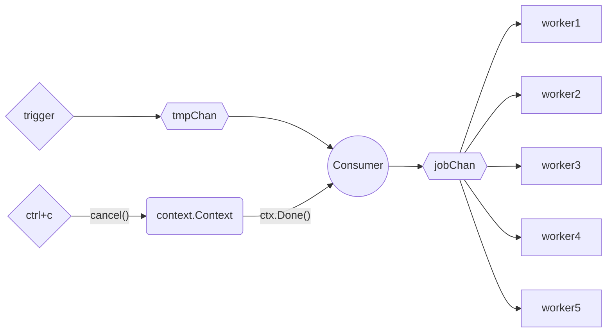

# Complete jobs before shutting down the service

# Flowchart

```mermaid
flowchart LR

trigger{trigger}
shutdown{ctrl+c}
consumer((Consumer))
tmpChan{{tmpChan}}
jobChan{{jobChan}}
context(context.Context)

trigger --> tmpChan --> consumer --> jobChan
jobChan --> worker1
jobChan --> worker2
jobChan --> worker3
jobChan --> worker4
jobChan --> worker5

shutdown --> |"cancel()"| context --> |"ctx.Done()"| consumer 
```